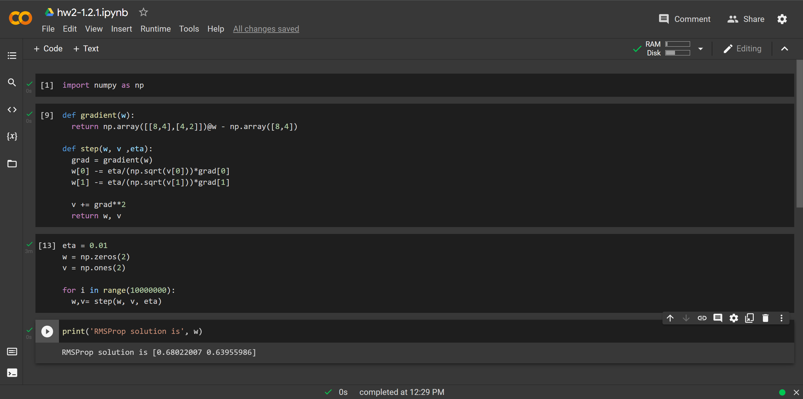
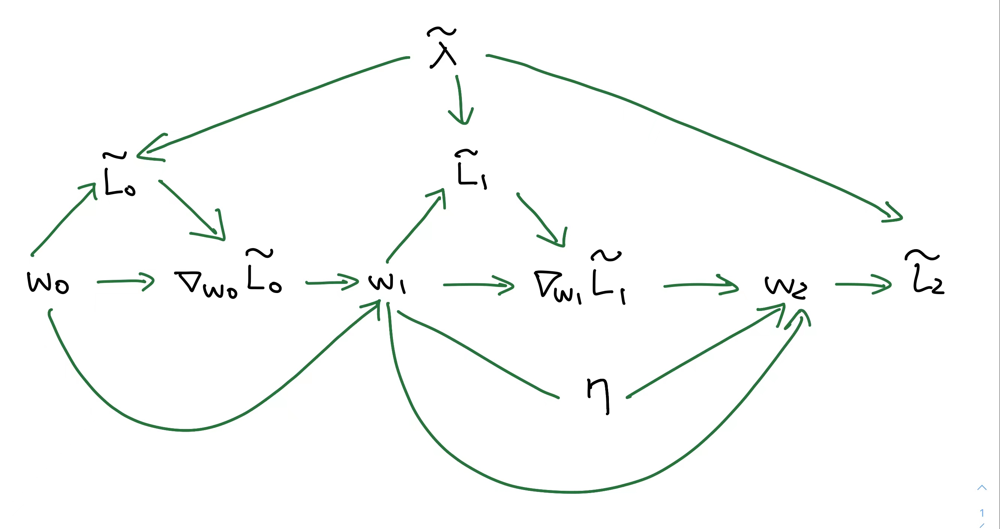

## Homework 2
### 1. Optimization
#### 1.1 Mini-Batch Stochastic Gradient Descent (SGD)
##### 1.1.1 Minimum Norm Solution
Recall from Question 3.3.2 from HW1, we find that the solution obtained by gradient descent is $w^* = X^T(XX^T)^{-1}t$ for $Xw^*=t$.

Let $w_0=0, d>n$. 
Assume mini-batch SGD converges to a solution $\hat{w}$ such that $X\hat{w} =t$.

WTS: $\hat{w} = w^*$ 

Since $x_j$ is the jth row of martix $X$, we know that $x_j$ is contained in the span of $X$. 

$$\begin{align*}
\frac{1}{b}\triangledown_{w_t} L(x_j,w_t) &=  \frac{1}{bn} \frac{\partial}{\partial w_t} ||x_jw_t-t_j||^2_2 \\
&= \frac{2}{bn} x_j^T(x_jw_t-t_j)
\end{align*} $$

Notice that the gradient is spanned by the rows of $X$. 

Now, we need to prove convergence of weights by setting the gradient of loss to weight to zero. 
$$\begin{align*}
\frac{2}{bn} x_j^T(x_jw_t-t_j) &= 0 \\
x_j^T(x_jw_t-t_j) &= 0 \\
x_j^T x_jw_t - x_j^Tt_j &= 0 \\
x_j^T x_jw_t &=  x_j^Tt_j \\
w_t &= \frac{x_j^Tt_j}{x_j^T x_j} \\
&= \frac{t_j}{x_j^T x_j}x_j^T 
\end{align*} $$

Notice that $t_j \in \R $ and $x_j^T x_j \in \R $. Therefore, $\frac{t_j}{x_j^T x_j} \in \R$. Let $c= \frac{t_j}{x_j^T x_j}$. Then, we have $w_t = cx_j^T $.  

Clearly, the update steps of mini-batch SGD never leavess the span of $X$. Thus, we can say that every updated weight can be wrriten in terms of a linear combination of rows of $X$. 

We can thus write $\hat{w} = X^Ta$ for some $a \in \R^n$. Thus, $$X\hat{w}-t = XX^Ta-t = 0$$
Therefore, 
$$\begin{align*}  XX^Ta &= -t\\
a &= (\mathbf{X}\mathbf{X}^T)^{-1}t  && \text{Since  when $n>d$, $XX^T$ is invertible}  \\
X^Ta &= X^T(XX^T)^{-1}t\\
\hat{w} &= w^*
\end{align*}$$

#### 1.2 Adaptive Methods
#####  1.2.1 Minimum Norm Solution
Let $d>n$.
Assume the RMSProp optimizer converges to a solution. 
As hinted, let $x_1= [2,1]$, $w_0=[0,0]$, $t=[2]$.
As clarified in piazza @503, $x_1$ is a row in the data matrix $X$ and $w_0 $ is a column vector.

$$\begin{align*} 
w^*  
&=  x_1(x_1^Tx_1)^{-1}t \\
&= x_1 \cdot \frac{1}{5} \cdot 2 \\
&= \frac{2}{5} x_1 \\
&= \begin{pmatrix}\frac{4}{5}\\ \frac{2}{5}\end{pmatrix} \\
&= \begin{pmatrix}0.8\\ 0.4\end{pmatrix} 
\end{align*}$$

Thus, the minimum norm solution is $\frac{2}{5}x_1$.
For the RMSProp optimizer: 

$$\begin{align*} \triangledown_{w} L 
&= \frac{2}{n}x_1(x_1^Tw-t)\\
&= \frac{2}{n} (x_1x_1^Tw-x_1t) \\
&= \frac{2}{n} \left[\begin{pmatrix}2\\1\end{pmatrix}\begin{pmatrix}2&1\end{pmatrix}w - \begin{pmatrix}2\\ 1\end{pmatrix}t\right] \\
&= \frac{2}{n}\left[\begin{pmatrix}4&2\\ 2&1\end{pmatrix}w-\begin{pmatrix}2\\ 1\end{pmatrix}t\right] \\
&= \frac{2}{n}\left[\begin{pmatrix}4&2\\ 2&1\end{pmatrix}w-\begin{pmatrix}4\\ 2\end{pmatrix}\right] \\
 \end{align*} $$

Let $n=1$. Then, we have $\triangledown_{w} L=\left[\begin{pmatrix}8&4\\ 4&2\end{pmatrix}w-  \begin{pmatrix}8\\ 4\end{pmatrix} \right]$

Then, we need to check whether it converges to the minimum norm solution. Inspired by piazza @460, I decided to write some code to see what the RMSProp converges to.

Clearly, the RMSProp result converges to a different solution when $\eta = 0.01$ and therefore, RMSProp does not always obtain the minimum norm solution which is $ \begin{pmatrix}0.8\\ 0.4\end{pmatrix}  $.

### 2. Gradient-based Hyper-parameter Optimization
#### 2.1 Computation Graph
##### 2.1.1 

##### 2.1.2 
The memory complexity for the forward-propagaion is O(1) and for the standard backward-propagation is O(t).
#### 2.2 Optimal Learning Rates
##### 2.2.1
Recall that $ L = \frac{1}{n}||X\hat{w}-t||^2_2$ and $\triangledown L= \frac{2}{n} X^T(X\hat{w}-t)$.
Therefore, we have $w_{i+1} = w_i - \frac{2 \eta}{n} X^T(Xw_i-t) $ .
Accordingly, we know that $w_1 = w_0 - \frac{2 \eta}{n} X^T(Xw_0-t)$ .
As hinted, let $a = Xw_0 - t$.
Then, we have $w_1 = w_0 - \frac{2 \eta}{n} X^Ta $ .
Then, 
$$ \begin{align*} L_1 &= \frac{1}{n}||Xw_1-t||^2_2 \\
&= \frac{1}{n} ||X(w_0 - \frac{2 \eta}{n} X^Ta)-t||^2_2 \\
&= \frac{1}{n} ||Xw_0- \frac{2 \eta}{n}XX^Ta-t||^2_2 \\
&= \frac{1}{n} ||Xw_0- t - \frac{2 \eta}{n}XX^Ta||^2_2 \\
&= \frac{1}{n} ||a- \frac{2 \eta}{n}XX^Ta||^2_2 \\
&= \frac{1}{n} ||a- cXX^Ta||^2_2  &&\text {let $c=\frac{2 \eta}{n}$ } \\
&= \frac{1}{n} \left[a- cXX^Ta\right]^T \left[a- cXX^Ta\right] \\
&= \frac{1}{n}\left[a^T-\left[cXX^Ta\right]^T\right]\left[a- cXX^Ta\right]  &&\text{since $(A-B)^T=A^T-B^T$} \\
&= \frac{1}{n}\left[a^T-ca^TXX^T\right]\left[a- cXX^Ta\right]  &&\text{since $(ABC)^T = C^TB^TA^T$} \\ 
&=\frac{1}{n}\left[a^Ta-a^TcXX^Ta-ca^TXX^Ta+c^2a^TXX^TXX^Ta\right]  \\
&= \frac{1}{n}\left[a^Ta-2a^TcXX^Ta+c^2a^TXX^TXX^Ta\right] \\
&= \frac{1}{n}a^T\left[I-2cXX^T+c^2XX^TXX^T\right]a \\
&= \frac{1}{n}a^T\left[I-cXX^T\right]^2a \\
&= \frac{1}{n}a^T\left[I-\frac{2 \eta}{n}XX^T\right]^2a \\
&= \frac{1}{n}\left[Xw_0 - t\right]^T\left[I-\frac{2 \eta}{n}XX^T\right]^2\left[Xw_0 - t\right] \\
\end{align*}$$

##### 2.2.3
$$ \begin{align*}
\triangledown_\eta L_1 &= \triangledown_\eta \left[\frac{1}{n}a^T\left[I-\frac{2 \eta}{n}XX^T\right]^2a\right] \\ 
&= \frac{1}{n} \triangledown_\eta \left[a^T\left[I-\frac{2 \eta}{n}XX^T\right]^2a\right] \\ 
&= \frac{1}{n}a^T 2 \left[I-\frac{2 \eta}{n}XX^T\right]\left[-\frac{2 }{n}XX^T\right]a \\
\end{align*}$$

Then, we need to set it to zero for GD.
Thus, we have,

$$\begin{align*}
a^T 2 \left[I-\frac{2 \eta^*}{n}XX^T\right]\left[-\frac{2 }{n}XX^T\right]a &= 0 \\
a^T  \left[I-\frac{2 \eta^*}{n}XX^T\right]\left[XX^T\right]a &= 0 \\
a^T [XX^T-\frac{2 \eta^*}{n}XX^TXX^T]a&= 0 \\
a^T XX^Ta-a^T \frac{2 \eta^*}{n}XX^TXX^Ta &= 0\\
a^T \frac{2 \eta^*}{n}XX^TXX^Ta &=  a^T XX^Ta \\
\frac{2 \eta^*}{n} &= \frac{a^TXX^Ta}{a^TXX^TXX^Ta} \\
\eta^* &= \frac{na^TXX^Ta}{2a^TXX^TXX^Ta} \\
\eta^*&= \frac{n(X^Ta)^TX^Ta}{2(XX^Ta)^TXX^Ta}\\
\eta^*&= \frac{n}{2}\cdot \frac{(X^Ta)^T(X^Ta)}{(XX^Ta)^T(XX^Ta)}\\
\end{align*}$$
#### 2.3 Weight decay and L2 regularization
##### 2.3.1
We know that $\tilde L = L + \tilde \lambda ||w||^2_2$.
Also, recall from 2.2.1,  $\triangledown_{w_0} L= \frac{2}{n} X^T(Xw_0-t) = \frac{2}{n} X^Ta$ where $a=Xw_0-t$.
Therefore, 
$$\begin{align*}
    \triangledown_{w_0} \tilde L &=  \triangledown_{w_0} L + \frac{\partial}{\partial w_0} \tilde \lambda ||w_0||^2_2 \\
    &= \frac{2}{n} X^Ta +  \tilde \lambda \frac{\partial}{\partial w_0} ||w_0||^2_2 \\
    &= \frac{2}{n} X^Ta +  \tilde \lambda 2 w_0\\
\end{align*}$$

According to equation (5) in handout and piazza @440, $w_{i+1} = (1-\lambda)w_i - \eta \triangledown L_{w_i}(X)$.
Thus, $w_{1} = (1-\lambda)w_0 - \eta \triangledown L_{w_0}(X)$.
Therefore,
- expression for $w_1$ using $\tilde L$ : 
  $$ \begin{align*}
  w_{1} &= (1-\lambda)w_0 - \eta  [\frac{2}{n}X^Ta +  \tilde \lambda 2 w_0] \\ 
  &= (1-\lambda)w_0 - (2\eta \tilde \lambda)w_0 - \eta \frac{2}{n}X^Ta \\
  &= w_0 (1-\lambda -2\eta \tilde \lambda) - \frac{2\eta }{n}X^Ta
  \end{align*}$$.

- expression for $w_1$ using $ L$ : $w_{1} = (1-\lambda)w_0 - \eta (\frac{2}{n} X^Ta)$.
##### 2.3.2
Clarified by piazza @523, we are looking for the value of $\tilde \lambda$ that will result in the same regularization as the case in weight decay. i.e. $w_1$ from $L_2$ regularization = $w_1$ from weight decay. 

If so, then $w_0 (1-\lambda -2\eta \tilde \lambda) = (1-\lambda)w_0$ must be true according to 2.3.1.
Thus, 
$$ \begin{align*}
1-\lambda -2\eta \tilde \lambda &= 1-\lambda \\
-2\eta \tilde \lambda &= 1-\lambda - (1-\lambda) \\
2\eta \tilde \lambda &= (1-\lambda) - (1-\lambda) \\
2\eta \tilde \lambda &= 1-\lambda - 1+\lambda \\
2\eta \tilde \lambda &= 0 \\
\tilde \lambda &= 0 \\\end{align*}$$

Therefore, setting $\tilde \lambda = 0$ will do the job.
### 3. Convolutional Neural Networks
#### 3.1 Convolutional Filters
$$I*J = \begin{bmatrix}
    0 & 1 & 2 & 3 & 2 \\
    2 & 3 & 3 & 2 & 1 \\
    1 & 1 & 1 & -1 & -1 \\
    -2 & -2 & -2 & -1 & -1 \\
    -1 & -2 & -3 & -2 & -1 \\
    \end{bmatrix}
$$
This convolutional filter detect edges of the input image. 
#### 3.2 Size of Conv Nets
- For CNN Architecture: 
  - Number of parameters = $10 + 0 + 10 + 0 + 10 = 30$
  - Number of neurons = $32 \times 32 +  32 \times 32 + 16 \times 16 + 16 \times 16 + 8 \times 8 + 8 \times 8 = 2688$
- For FCNN Architecture: 
 
  -  Number of parameters = $ [(32 \times 32 +1) \times (32 \times 32)] + [(16 \times 16 +1) \times (16 \times 16)] + [(8 \times 8 +1) \times (8 \times 8)] = 1119552$
  -  Number of neurons = $32 \times 32 +  32 \times 32 + 16 \times 16 + 16 \times 16 + 8 \times 8 + 8 \times 8 = 2688$
  
  **note: according to piazza @419, input and output size are the same for FC.*

More trainable parameters tells us that this model requires more space compared to the other model, i.e. more trainable parameters lead to higher computational complexity.
#### 3.3 Receptive Fields
$$\begin{align*}
R_3 &= 1 + \sum_{j=1}^{3} (F_j-1)\prod_{i = 1}^{j-1} S_{i} \quad \\
&= 1 + (F_1-1)S_0 +(F_2-1)S_0S_1+(F_3-1)S_0S_1S_2 \\
&= 1 + (5-1)*1 +(2-1)*1*2+(5-1)*1*2*1 \\
&= 1+4+2+8 \\
&= 15
 \end{align*}$$

Therefore, the receptive field afterthe second convolutional layer is of size $15 \times 15$.

Besides changing the size of the filter/kernel, changing the number of pooling layers or changing the number of convolutional layers can both lead to change in the size of the receptive field of a neuron. 