##  Programming Assignment 2
  
###  Part A: Pooling and Upsampling
  
####  A.1 Implementation of PoolUpsampleNet
  
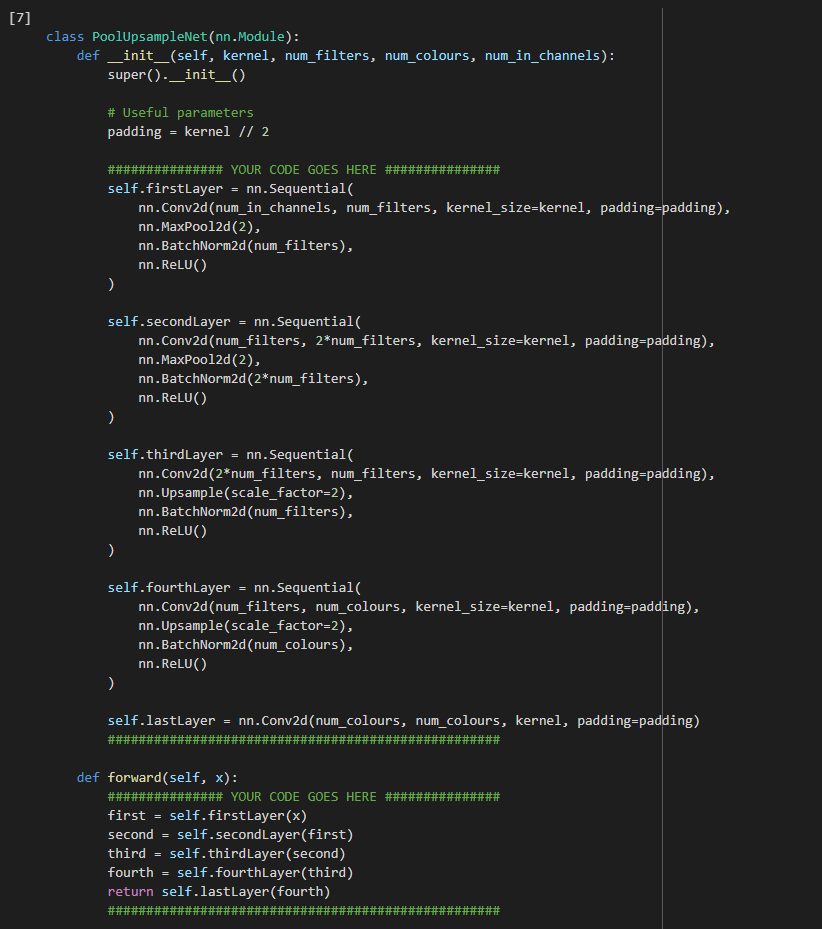
  
####  A.2 Training Result
  
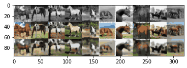
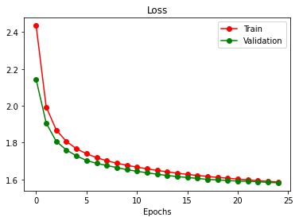
The shown figure is the result obtained from the main training loop of PoolUpsampleNet. It does not look good to me as the images are quite blurry with greyscale pixels present. Also, after 25 epoch, accuracy is around 41.4%, which is quite low.
  
####  A.3
  
Assume the kernel size is $k$
- when each input dimension (width/height) is not doubled (original input)
  - number of weights =
  - number of outputs =
  - number f connections =
- when each input dimension (width/height) is doubled
  - number of weights =
  - number of outputs =
  - number f connections = 
  
  
###  Part B: Strided and Transposed Dilated Convolutions
  
####  B.1 Implementation of ConvTransposeNet

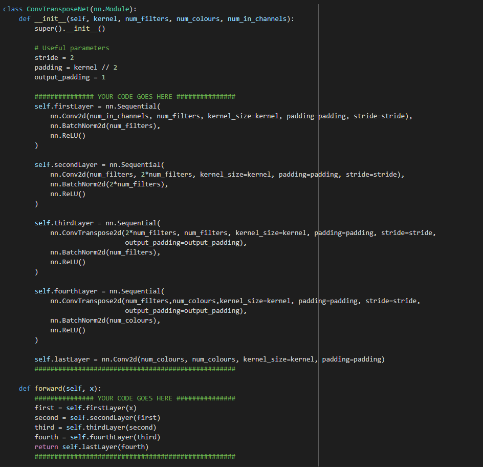

  
####  B.2
  

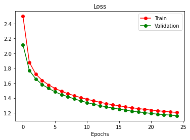
####  B.3 
 The trained result from ConvTransposeNet model seems better from what we got from PoolUpsampleNet because 
 - the image seems less blurry 
 - the validation accuracy increases from 41.4% to 54.7%. 
 - the validation loss decreases from 1.5848 to 1.1565. 
 
 This decrease in validation loss might be resulted from ...
####  B.4
  
####  B.5
  
###  Part C: Skip Connections
  
####  C.1 Implementation of UNet
  
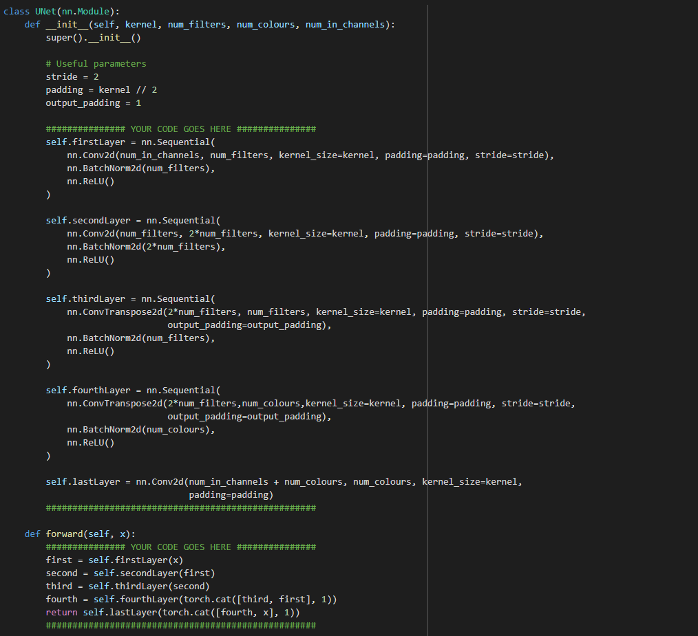

####  C.2
  
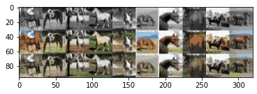
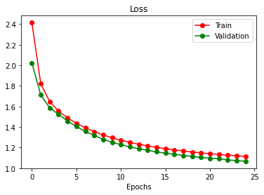

####  C.3
The trained result from UNet model seems to be the best out of these three models because: 
- the image obtained from skip connections seems to be the least blurry most among all three
- the validation loss from UNet is 1.0512 after 25 epoch, which is smaller than 1.5848 (from Part A) and 1.1565 (from Part B).
- the validation accuracy is 58.9% which is greater than 41.4% (from Part A) and 54.7%(from Part B).

Two reasons why skip connections might improve the performance of our CNN models are:
- v   
-  d
###  Part D: Object Detection
####  D.1 Fine-tuning from pre-trained models for object detection
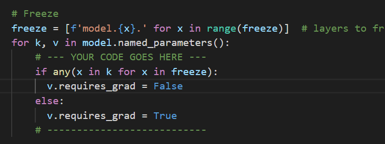

####  D.2 Implement the classification loss

##### D.2.1
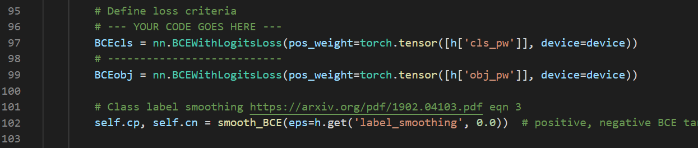
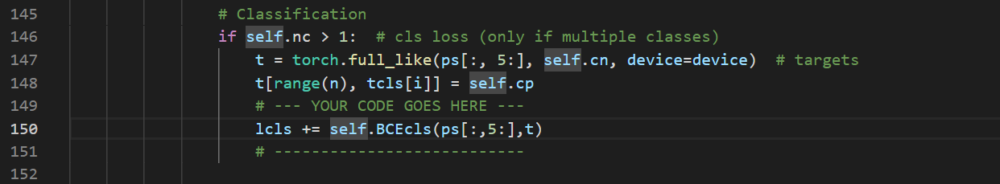

##### D.2.2
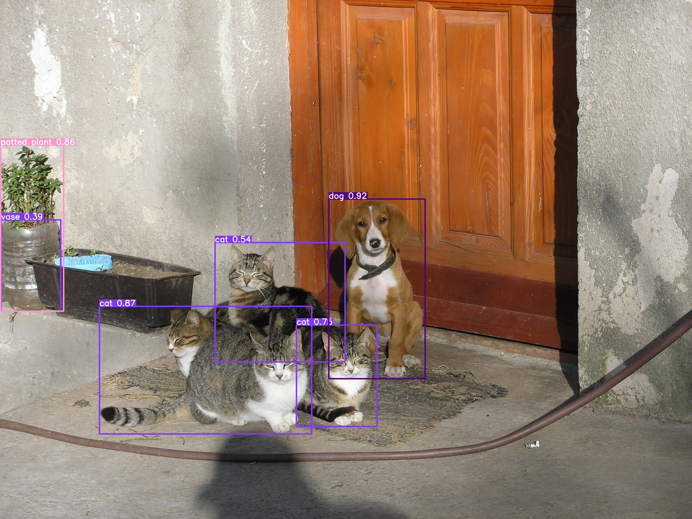
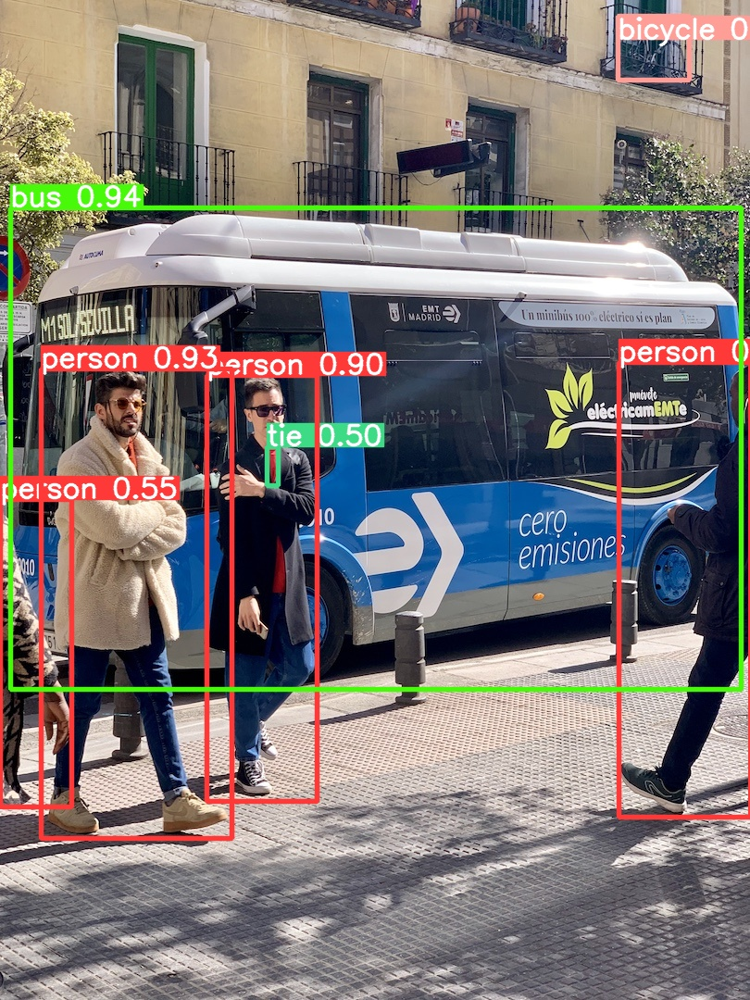
