### Programming Assignment 3: Natural Language Processing and Multimodel Learning

Name: Ruyi Qu
Student Number: 1004849569

#### Part 1 : Neural machine translation (NMT)
##### Q1 - Code a GRU Cell

The shown picture below is the screenshot of the code including both __init__ and __forward__ method.

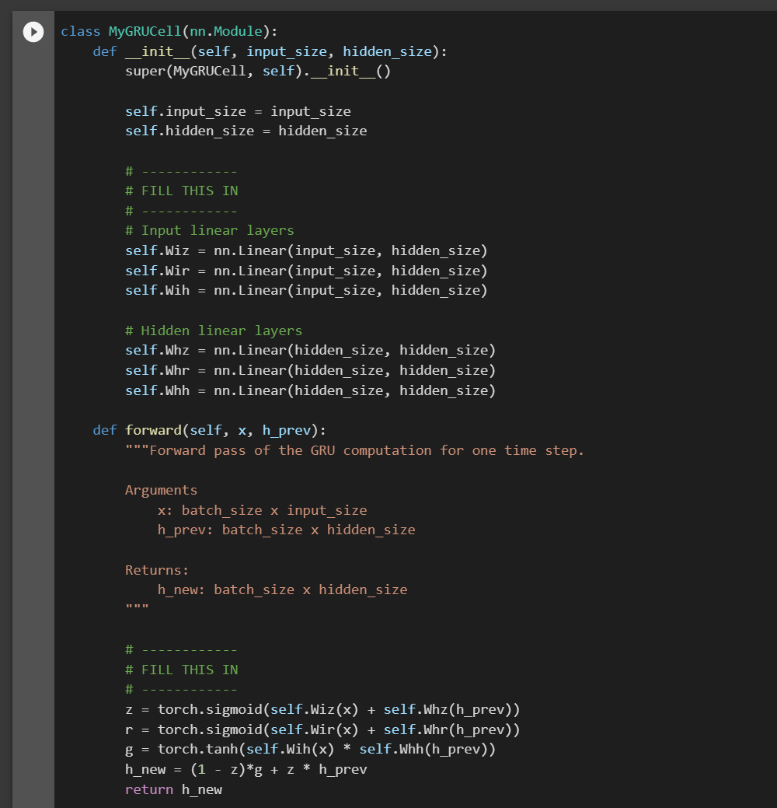

After the models have been trained on both datasets, __pig_latin_small__ and __pig_latin_large__, we got the picture (shown below) which compares the loss curves of the two models by running the __save_loss_comparison_gru__ method.

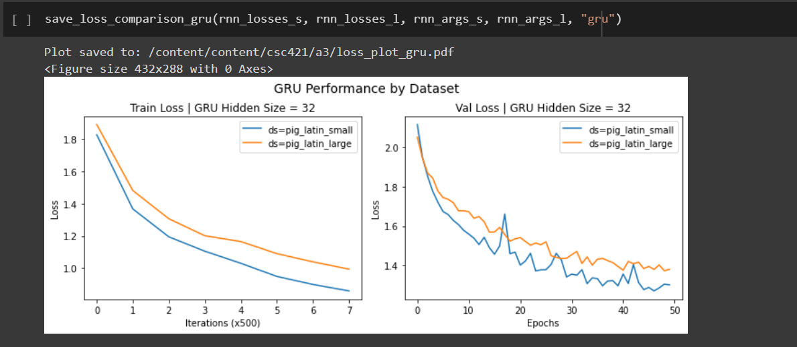
 
We can see from this comparison graph that validation loss is decreasing for both datasets, with the smaller dataset performing sognificantly better (i.e. a ,lower val loss that what's of large datasets). This might because that the larger dataset casuses the model to overfit and thus lead to a higher loss.

##### Q2 - Identify failure modes

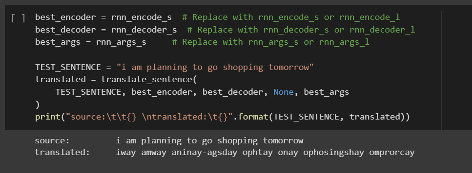

The correct translation is "iway amway anningplay otay ogay oppingshay omorrowtay". We can see that longer words are harder for our model to translate. For example, "i" and "am" are translated correctly but long words like "tomorrow" failed.  
##### Q3 - Comparing complexity
- LSTM encoder: $4 \times (𝐻 + 𝐷) \times 𝐻$ parameters
- GRU encoder: $3 \times (𝐻 + 𝐷) \times 𝐻$ parameters
#### Part 2.1 : Additive Attention
##### Q3 
It took 2m58s to run the RNN model with additive attention but only 2m13s for RNN model without additive attention. This happens because it adds more weight parameters to the model and therefore makes it a method with higher training time.

#### Part 2.2 : Scaled Dot Product Attention
##### Q1 - Implement the scaled dot-product attention mechanism
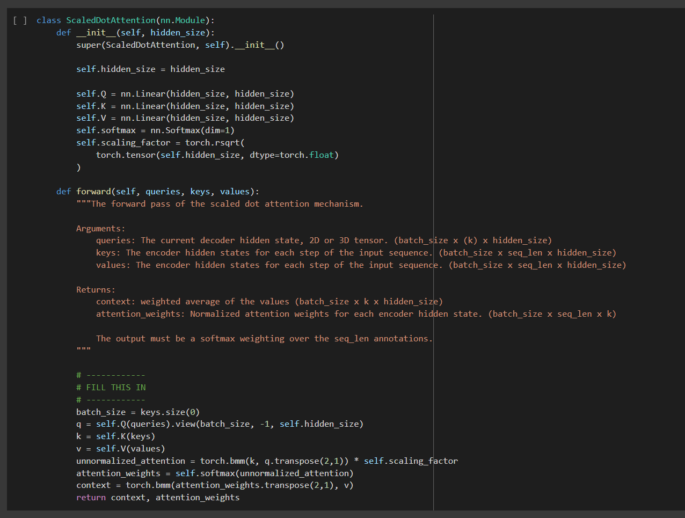
##### Q2 - Implement the causal scaled dot-product attention mechanism
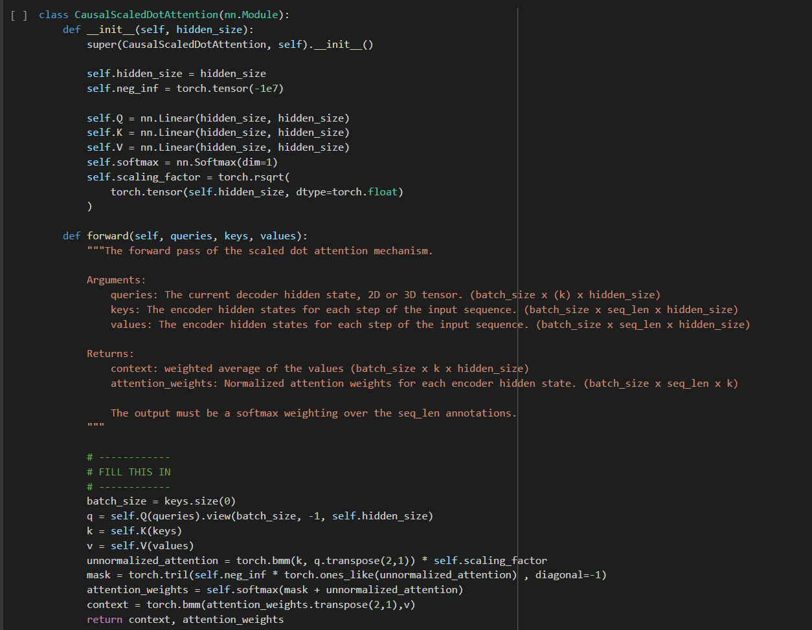
##### Q3 
As shown in the picture below, a model using ScaledDotAttention mechanism as an encoder and decoder (i.e. single block dot-product attention model) has a lowest estimated val loss of 1.083.
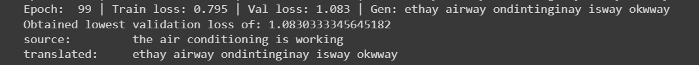
Meanwhile, RNNAttention model as presented in the picture below has a lowest estimated val loss of 0.439. 
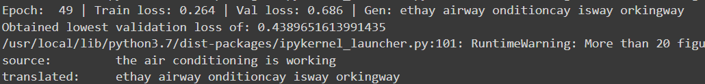
Clearly, we know that RNNAttention model performes better than the single block dot-product attention model as it has a lower val loss. This might because that RNNAttention has more parameters, which in turn, leads to a better estimation (i.e. reduced residuals) though it might result in a much slower training rate. 
##### Q4
- Since this model is working on sequences, there must be a way where we would be able to "describe" the sequence and tokens within the sequence and its relative or absolute position. By doing so, we will be able to represent any token within any given sequence if we need. 
- One-hot encoding is extremely inefficient when dealing with large volcabularies as it is designed in such way that each of its token will be a vector of a size equal to the volcabulary size. However, positional encoding has the same dimension as the embeddings, which are by definition relatively low-dimensional and therefore is more efficient (when facing large volcabularies).

##### Q5
The below picture is the result I obtained from transformer:
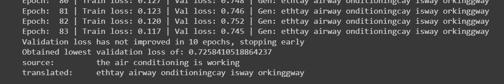

**The correct translation should be:** ethay airway onditioningcay isway orkingway
- **Compare to RNNAttention decoder:**
  *(The below picture is the result I obtained from RNNAttention)*
  
  Notice that both RNNAttention decoder and transformer made minor mistake while trying to translate this sentence. However, RNNAttention decoder generates a lower loss than transformer.
- **Compare to single-block attention decoder:**
*(The below picture is the result I obtained from single-block attention decoder)*

Notice that both single-block attention decoder and transformer made mistakes while trying to translate this sentence, though single-block attention decoder made larger mistakes (should be *orkingway* instead of *okwway* and *onditioningcay* instead of *ondintinginay*) than the minor ones RNN attention made (should be *orkingway* instead of *orkinggway*). Single-block attention decoder also has a larger loss than whats of transformer model.

##### Q6
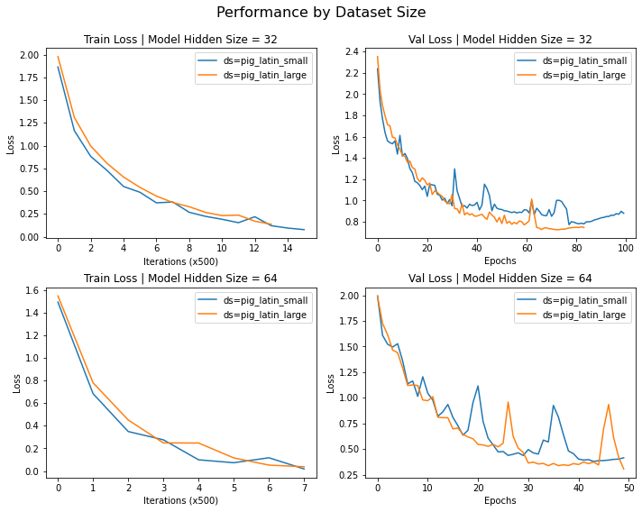
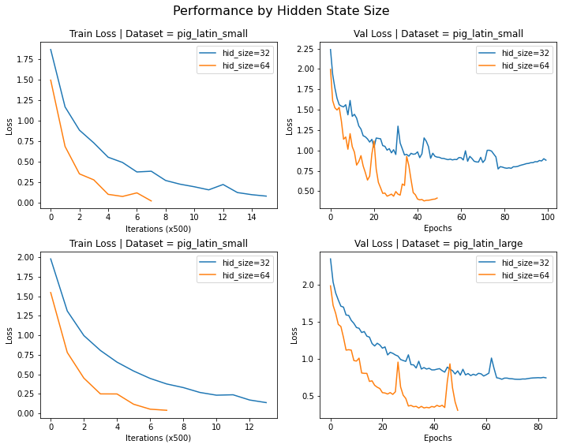
We run the Transformer model using hidden size 32 vs. 64, and using the small vs. large dataset (in total, 4 runs). Below table illustrates what we got from each run.
|    |      pig_latin_small      |  pig_latin_large |
|----------|:-------------:|------:|
| **hidden size = 32**|  0.9501068491670417|  0.7258410518864237 |
| **hidden size = 64** |    0.3802134682160072   |  0.30701605956918293 |
By this table, we know that when fixing the dataset, increase in hidden size will decrease the validation loss but will take longer, vice versa. And, when fixing the hidden size, increase in data size will decrease the validation loss (but the training takes a longer time) and thus lead to a better performance. vice versa. 

These results meet my expectation perfectly. My reasoning is as follows:
- when fixing the dataset, increase in hidden size will increase number of parameters thus increase the training time. This increase in parameter also decreases the loss as it gives a better generalization. Vice versa.
- when fixing the hidden size, increase in data size will give the more data to learn insight from and therefore will help with generalization and decrease validation loss. This will, however, also increase the training time.

#### Part 3 : Fone-tuning Pretrained Language Models (LMs)
##### Q1 - Add a classifier to **BERT**
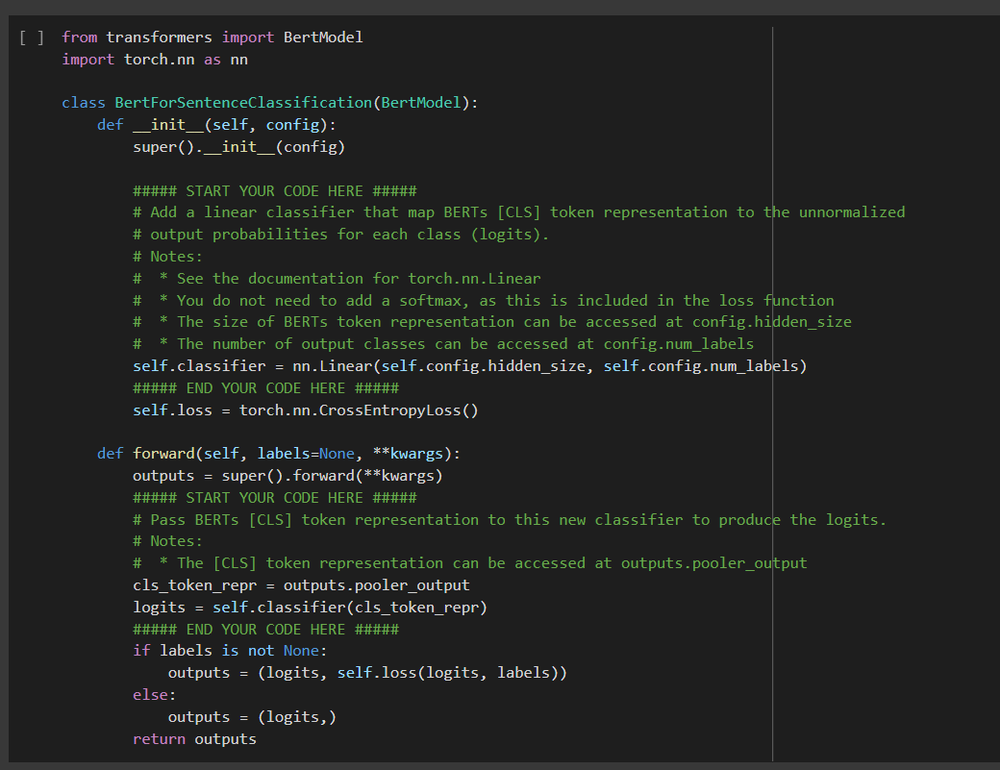
##### Q3 - Freezing the pretrained weights
- The results generated by fine-tuning 
  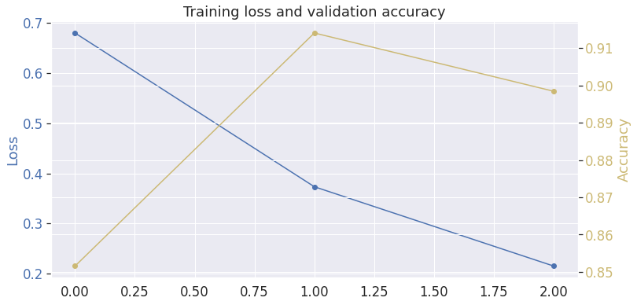
  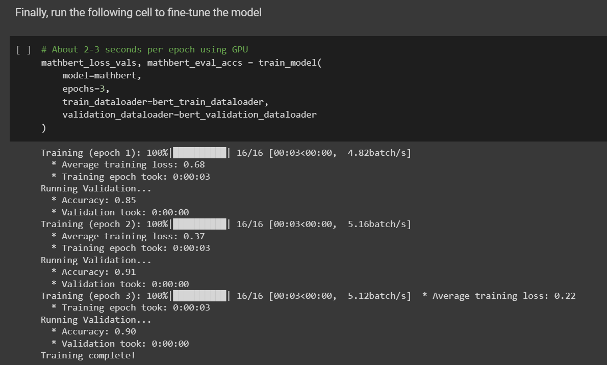
- The results generated by fine-tuning  only the classifiers weights, leavng BERT's weight frozen:
  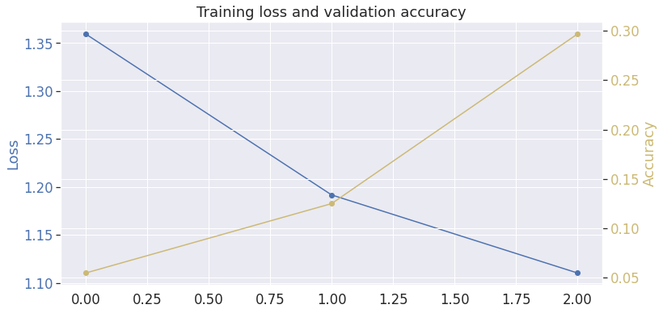
  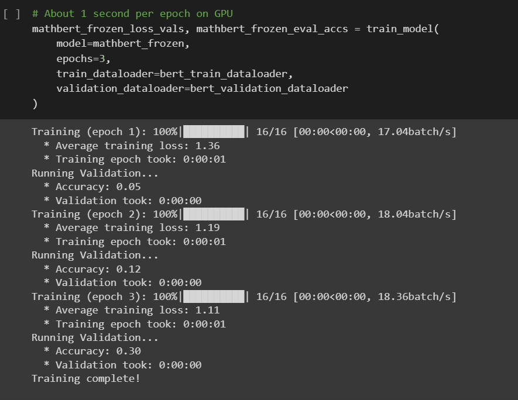

**(1)** Compared to fine-tuning, the **train time** is faster when BERTs weights are frozen. This might because when BERTs weights are frozen, we are only training the parameters of the classifiers rather than fine-tune both ther classifer and BERT model jointly. When number of parameters decreases, training time decreases as well.

**(2)** Compared to fine-tuning, the model **perform** worse when BERTs weights are frozen. This might also because of the mentioned reason. Fine-tuning has more parameters involved and therefore have a lower validation loss and thus performs better when BERTs weights are NOT frozen.
##### Q4 - Effect of pretraining data.
- The results generated by fine-tuning BERT with the pretrained weights from MathBERT
  
  
- The results generated by fine-tuning BERT with the pretrained weights from BERTweets
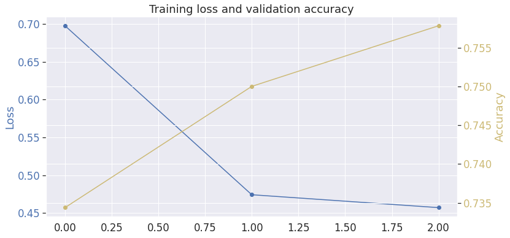
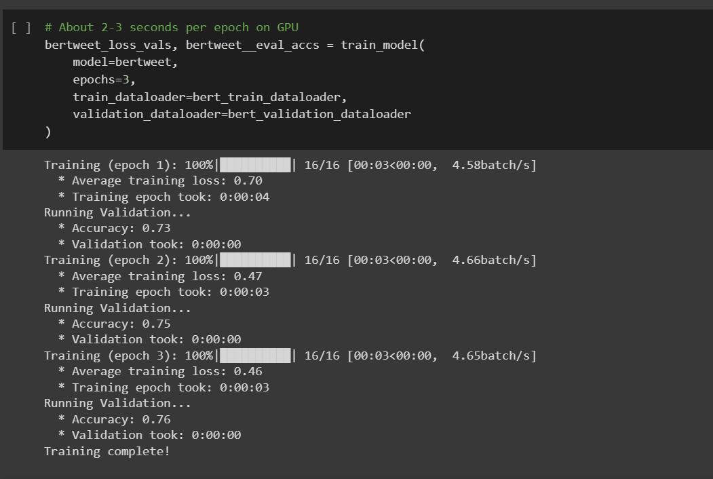

Compared to fine-tuning BERT with the pretrained weights from MathBERT, the model perform worse when we fine-tune BERT with the pretrained weights from BERTweets as $0.76<0.90$. This is because the dataset we are using is a verbal arithmetic dataset and the task the model is asked to do is to do math. Words like "minus" or "add" which are so simple and clear in MathBERT but since these words are not commonly used words in tweets, it might add noise to the training process. For example, MathBERT can easily know that add means arithmetic addition, wheras BERTweets might interpret it as short for "advertising", which will then impact the performance negatively.

#### Part 4 :  Connecting Text and Images with CLIP
##### Q2 - Prompting CLIP
The caption I used is : "an orange butterfly on a purple flower". The process of finding the caption is easy. All we need to do is to give accurate descriptions to the objects' name, color and relative position. 