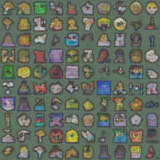
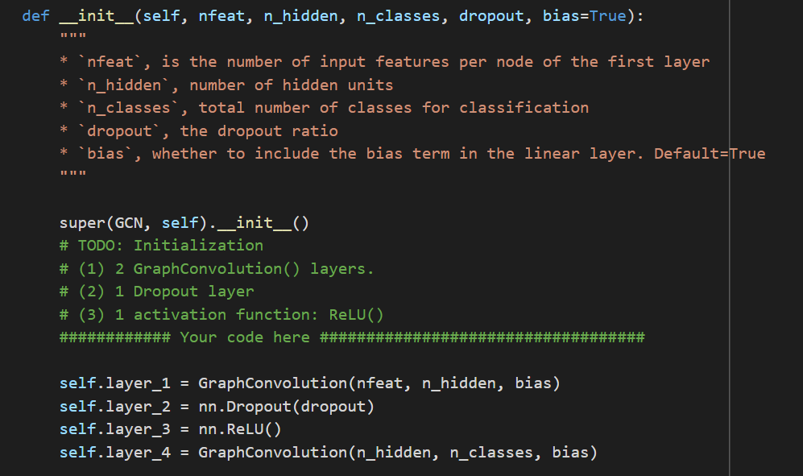

### Programming Assignment 4: DCGAN, GCN, and DQN

Name: Ruyi Qu
Student Number: 1004849569

### Part 1: Deep Convolutional GAN (DCGAN) 
#### Generator Implementation

#### Training Loop Implementation

#### Experiment
##### Q1

I trained the DCGAN to generate Windows emojis in the Training Section of the Notebook. Above is its corresponding loss graph. As we can see from this graph, result quality is overall increasing as the number of iteration increases. However, it does seem that the results are unstable. Sometimes there will be grayish result being generated after gaining a high quality result several iteractions eariler. One possible explanation to this situation is overfitting. However, regardless of the occasional bad results being produced, the quality of result we gained at the end (20000 iterations) is clearly better than what we got at the beginning. 

Note that figure produced at 19800 iteration looks better than the one we got at 20000 iterations, this might be because of overfitting as well.

  
 *2000 iteration -- early in the training* 

  
*6200 iteration* 

  
*13600 iteration* 

 
*19400 iteration* 

 
 *19800 iteration -- satisfactory image quality*

 | 
*19400 iteration --  towards the end of training* 

##### Q2
Below is the code I filled in in the gan_training_loop_leastsquares
function in the GAN section of the notebook

We turn on the the least_squares_gan flag in the args_dict and
train the model again. The result loss vs iteration graph is shown below.

One obvious difference we can see from the regular GAN is that least-squares GAN seem to be producing images with a much lower loss than what's of regular GAN. Also, the results are more stable than what's of the regular GAN. There is no result that is extremely blurry in the middle of the training. For example, the results we obtained at iteration 13600 is shown below, which looks way better than what we got from regular GAN. To sum up, least-squares GAN is more stablized during the learning process and generates higher quality images than regular GANs
 
*regular GAN: 13600 iteration* 

 
*least-squares GAN: 13600 iteration* 

One problem with regular GAN is that its use of sigmoid cross entropy as loss function will lead to the vanishing gradient problem -- the discriminator gets too successful that the generator gradient vanishes and learns nothing -- as the fake data that are used for updating the generator can be sometimes too far away from the real data.

As pointed out by Xudong Mao et al. in "Least Squares Generative Adversarial Networks" in 2017, LSGANs solves this problem by pulling these fake data closer to the real data by applying panalities to those that are further away on the decision boundary.
### Part 2: Graph Convolution Networks
#### Experiments
##### Q1

##### Q2

##### Q3

##### Q4

##### Q5

##### Q6
As we can see from the evaluation results for Vanilla GCN and GAT, GAT has a relatively better test accuracy (about 0.72) but yet takes a lot longer to run (about 85s for GAT but 1.2s for GCT). GAT has a better accuracy because instead of making the coefficient solely dependent on the structure of the graph as what GCN does, GAT takes each nodes' features, which are passed into an attention function, into account. GAT requires more time because making the coefficient a learnable attention mechanism leads to more calculation and therefore more time to execute.

### Part 3: Deep Q-Learning Network (DQN)
#### Experiments
##### Q1

##### Q2

##### Q3
The parameters I chose are:
- exp_replay_size = 40
- episodes = 20000
My epsilon decay rule is : epsilon = epsilon * 0.99

The final video I got is about 3 seconds long with a self-balancing pole moving to the right. The pole is a bit trembling though.
